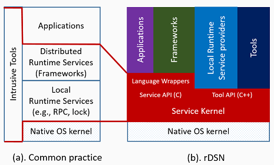
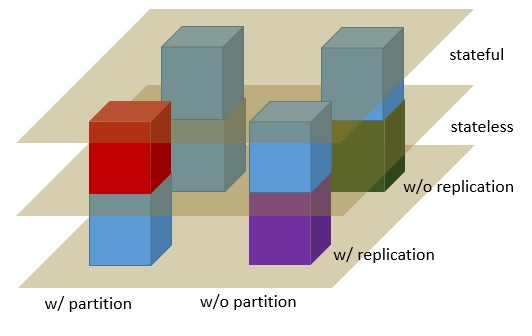
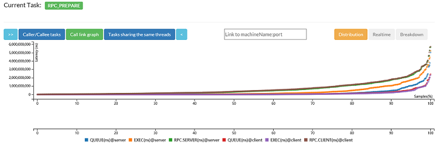
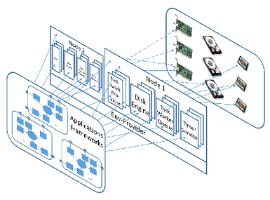

 

All pull requests please now go to https://github.com/imzhenyu/rdsn for automatic integration with latest version. We will preriodically update this repo. Thank you.

### Top Links
 * [[Case](https://github.com/imzhenyu/rocksdb)] RocksDB made replicated using rDSN!
 * [[Tutorial](https://github.com/Microsoft/rDSN/wiki/Tutorial:-Build-A-Single-Node-Counter-Service)] Build a counter service with built-in tools (e.g., codegen, auto-test, fault injection, bug replay, tracing)
 * [[Tutorial](https://github.com/Microsoft/rDSN/wiki/Tutorial:-Build-A-Scalable-and-Reliable-Counter-Service)] Build a scalable and reliable counter service with built-in replication support
 * [[Tutorial](https://github.com/Microsoft/rDSN/wiki/Tutorial:-Perfect-Failure-Detector)] Build a perfect failure detector with progressively added system complexity
 * [[Tutorial](https://github.com/Microsoft/rDSN/wiki/Tutorial:-Plugin-A-New-Network-Implementation)] Plugin my own network implementation for higher performance
 * [Installation](https://github.com/Microsoft/rDSN/wiki/Installation)
 

**Robust Distributed System Nucleus (rDSN)** is a framework for quickly building robust distributed systems. It has a microkernel for pluggable components, including applications, distributed frameworks, devops tools, and local runtime/resource providers, enabling their independent development and seamless integration. The project was originally developed for Microsoft Bing, and now has been adopted in production both inside and outside Microsoft. 

* [How does rDSN build robustness?](#novel)
* [What I can do with rDSN?](#cando)
* [What are the existing modules I can immediately use?] (#existing)

### <a name="cando"> What I can do with rDSN? </a>

 * an enhanced event-driven RPC library such as libevent, Thrift, and GRPC
 * a production Paxos framework to quickly turn a local component (e.g., rocksdb) into a online service with replication, partition, failure recovery, and reconfiguration supports
 * a scale-out and fail-over framework for stateless services such as Memcached
 * more as you can imagine.

### <a name="novel"> How does rDSN build robustness? </a> 

 * **reduced system complexity via microkernel architecture**: applications, frameworks (e.g., replication, scale-out, fail-over), local runtime libraries (e.g., network libraries, locks), and tools are all pluggable modules into a microkernel to enable independent development and seamless integration (therefore modules are reusable and transparently benefit each other) 
 
 * **auto-handled distributed system challenges**: built-in frameworks to achieve scalability, reliability, availability, and consistency etc. for the applications
 
 * **transparent tooling support**: dedicated tool API for tool development; built-in plugged tools for understanding, testing, debugging, and monitoring the upper applications and frameworks. [Demo](https://www.youtube.com/watch?v=FKNNg3Yzu6o) 
 
 * **late resource binding with global deploy-time view**: tailor the module instances and their connections on demand with controllable system complexity and resource mapping (e.g., run all nodes in one simulator for testing, allocate CPU resources appropriately for avoiding resource contention, debug with progressively added system complexity) 
  
 
 
### <a name="existing">Existing pluggable modules (and growing) </a>

##### Distributed frameworks

 * a production Paxos framework to quickly turn a local component (e.g., rocksdb) into an online service with replication, partition, failure recovery, and reconfiguration supports
 * a scale-out and fail-over framework for stateless services such as Memcached

##### Local runtime libraries 

 * network libraries on Linux/Windows supporting rDSN/Thrift/HTTP messages at the same time
 * asynchronous disk IO on Linux/Windows
 * locks, rwlocks, semaphores
 * task queues 
 * timer services
 * performance counters
 * loggers (high-perf, screen)

##### Devops tools

 * nativerun and fastrun enables native deployment on Windows and Linux 
 * simulator debugs multiple nodes in one single process without worry about timeout
 * explorer extracts task-level dependencies automatically
 * tracer dumps logs for how requests are processed across tasks/nodes
 * profiler shows detailed task-level performance data (e.g., queue-time, exec-time)
 * fault-injector mimics data center failures to expose bugs early
 * global-checker enables cross-node assertion 
 * replayer reproduces the bugs for easier root cause analysis
 * build-in web studio to visualize task-level performance and dependency information

##### Other distributed providers and libraries

 * remote file copy 
 * perfect failure detector
 * multi-master perfect failure detector 

### License and Support

rDSN is provided on Windows and Linux, with the MIT open source license. You can use the "issues" tab in GitHub to report bugs. 

